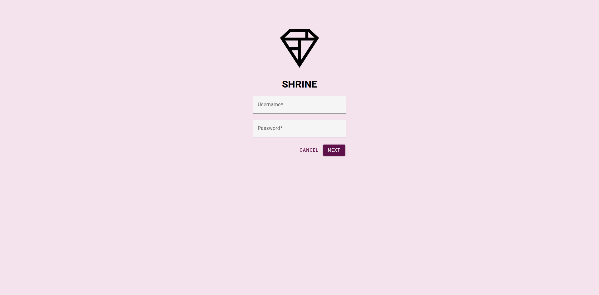
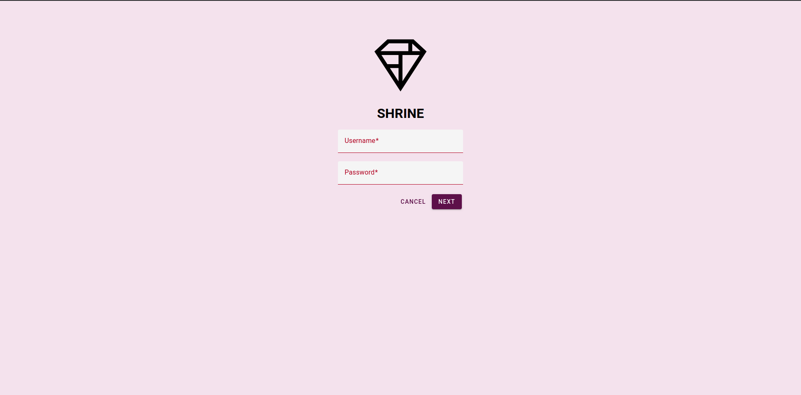

# Material Design Components Web Tutorial

This is an implementation of the [Material Design and Material Components for the Web Tutorial](https://material.io/collections/developer-tutorials/#web).

## How to Install and Run

**1. Check if you have a recent version of [Node.js](https://nodejs.org/) (which comes bundled with [npm](https://www.npmjs.com/), a JavaScript package manager):**

```bash
$ node -v
```

```bash
$ npm -v
```

**2. In the project root directory install all the dependencies and libs:**

```bash
$ npm install
```

**3. Start the webpack-dev-server:**

```bash
$ npm run start
```

- Or generate all the bundle:

```bash
$ npm run build
```

**4. Access [http://localhost:8080/](http://localhost:8080/) on your browser.**

- Type any valid credentials on the login form and click Next button.

# License

Please see the [license
agreement](https://github.com/julianomacielferreira/mdc-web-tutorial/blob/master/LICENSE).

# Screenshots




